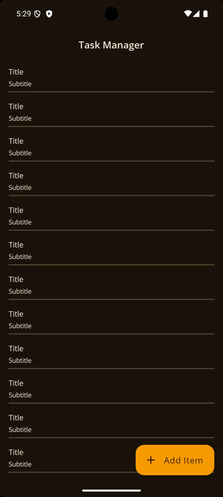
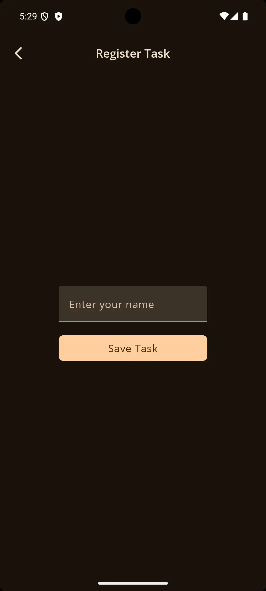
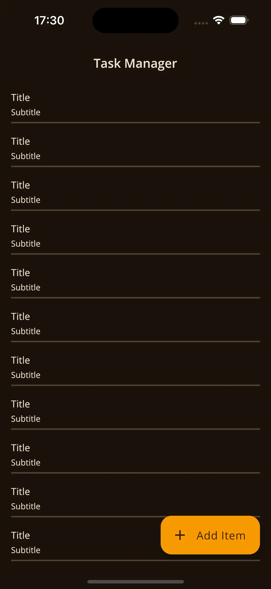
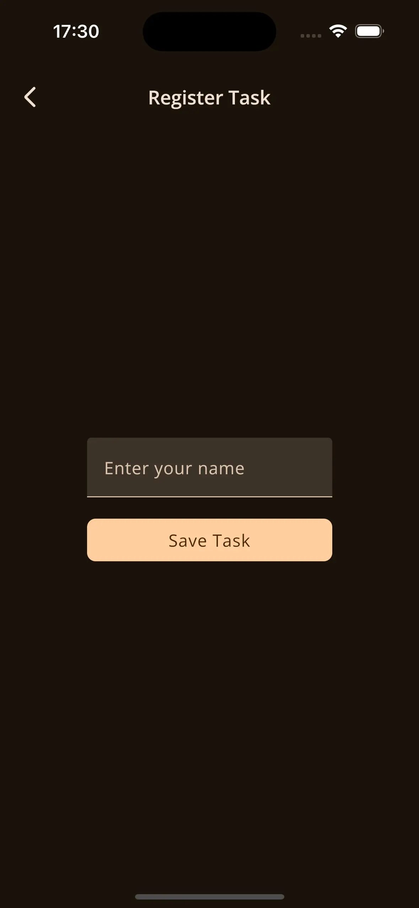

# 🛠️ Task Manager


> Starter project for building multiplatform applications using **Kotlin Multiplatform** e **Jetpack Compose Multiplatform**.

---

## 🚀 About the project

**Task Manager** is a project built with Kotlin Multiplatform, focused on creating a shared codebase for Android and iOS applications. It uses Jetpack Compose Multiplatform for UI and a modular structure that separates common code (commonMain) from platform specific code (iosMain, jvmMain).

---

### 🔧 Key features:

    . Shared business logic between Android and iOS
    . SwiftUI support in the iOS module
    . Scalable architecture with clear layer separation
    . Perfect for learning or implementing multiplatform architecture with Kotlin

## 📦 Project structure

    task-kmp/ 
        |── composeApp/ # Shared code across platforms |
        |   └── commonMain/ # Common logic (business rules, models, etc.) │
        |   └── iosMain/ # iOS-specific code
        |   └── jvmMain/ # Android/Desktop-specific code
        |── iosApp/ # iOS app entry point (SwiftUI)
        |── gradle/ # Build configuration
        |── build.gradle.kts
        |── settings.gradle.kts

---

## 📱 Technologies used

- [Kotlin Multiplatform](https://kotlinlang.org/docs/multiplatform.html)
- [Jetpack Compose Multiplatform](https://github.com/JetBrains/compose-multiplatform)
- [SwiftUI](https://developer.apple.com/xcode/swiftui/)
- Gradle Kotlin DSL

---

## 🧪 How to run

### Android
```bash
./gradlew :composeApp:androidApp:installDebug
```
### iOS
```bash
Open the iosApp project in Xcode and run it on a simulator or physical device.
```

## Screenshots

## Android and iOS




